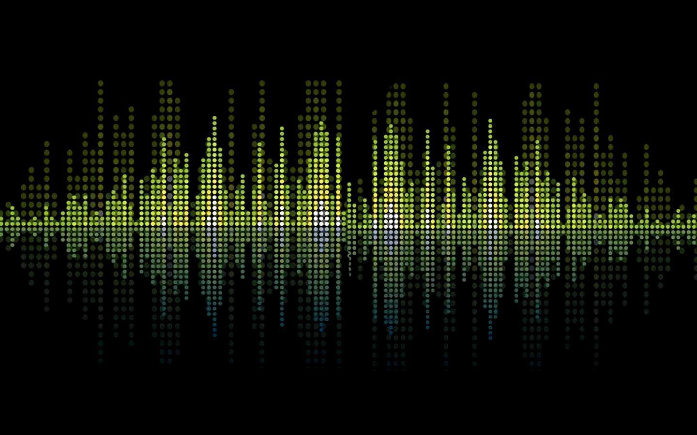
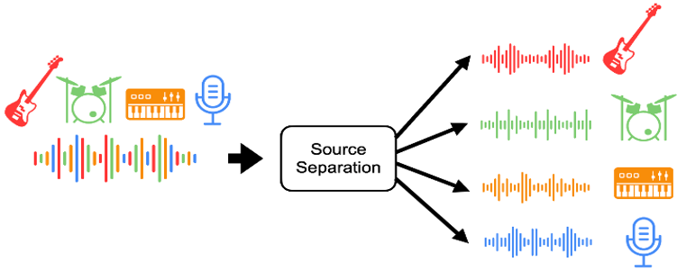

# V_SepPy

  

## Juin21 Bootcamp DS Projet Voice Separator

In this project you can separate the instruments of your own track to obtain a high quality audio. Thanks to [demucs](https://github.com/facebookresearch/demucs "demucs"), a deep learning model that directly operates on the raw input waveform and generates a waveform for each source, you can get the best source separation.

  

Then mix it up with other instruments from your favorite songs and if you like it loop until you cant hear ir anymore. Thanks to Mixer and Looper two applications that we adapted to use the output of the music source separation.

# Streamlit

This app allows you to upload a song and separate the voice, drums, bass and others and also allows you to take a look at the structure of the project.

### Requirements

You will need to install the [demucs](https://github.com/facebookresearch/demucs "demucs") environment and donwload the "Streamlit" folder inside it if you want to use the app.

#### Other packages:
    streamlit==0.86.0
    pygame==2.0.1
    librosa==0.8.1
    pydub==0.25.1
	pyvis==0.1.9

# Credits

This work is from Data Scientist training bootcamp at the DataScientest institute <a href="https://datascientest.com">(datascientest.com)</a> 

### Members:
<a href="https://www.linkedin.com/in/tawfa-ouissi-621492108/" target="new" rel="noopener noreferrer">
Tawfa OUISSI </a> 
<a href="https://www.linkedin.com/in/ernesto-horne-a8552a23/" target="new" rel="noopener noreferrer">
Ernesto HORNE </a> 
<a href="https://www.linkedin.com/in/dan-prz/" target="new" rel="noopener noreferrer">
Daniel PEREZ </a> 
Michel DJIMASSE

### Mentor:
<a href="https://www.linkedin.com/in/ayoub-bakkoury-204a3a16a/" target="new" rel="noopener noreferrer">
Ayoub Bakkoury (DataScientest) </a>
